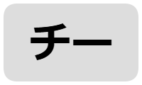
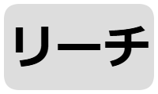

# RetroArch Mahjong Overlay

[日本語](./README.md) | [English](./README.en.md)

## Overview

Playing mahjong games on RetroArch's MAME/FBNeo can be difficult on devices without a physical keyboard, such as smartphones.
To help with this, I created a dedicated OSD overlay for mahjong games.

## Usage

1. Download
   - Visit the repository main page: `https://github.com/osobaudonmen/retroarch_mahjong_overlays`.
   - Click the green "Code" button.
   - Choose "Download ZIP" from the menu.
2. Extract & Install
   - Extract the downloaded ZIP file.
   - Copy the `overlays/mahjong/` directory from the extracted folder into RetroArch's `overlays/` directory.
3. Apply
   - Open the game's Quick Menu.
   - Select "On-Screen Overlay" then "Overlay Preset".
   - In the file browser, choose the appropriate overlay file from the copied `overlays/mahjong/` directory.

## Important notes

- To prevent tile and button misalignment on wide screens (smartphones, etc.), disable "Overlay Auto-scaling" in "Quick Menu > On-Screen Overlay".
- Multi-screen games (e.g. `hotgmck`) must be set to single-screen mode via the Dip Switches (see Notes).
- Some FBNeo versions have a bug where overlay keyboard input does not work as expected; modifying the core may be necessary.
- The BET button is `3` in MAME and `2` in FBNeo. Because more MAME games require the BET button, the overlays use `3`.

## Overlay description

Mahjong overlays for MAME/FBNeo are provided in:

```
overlays/mahjong/
```

The directory contains per-game `cfg` files tuned for button placement and the images used by the overlays.
Configuration files are named `mahjong_(ROM_filename).cfg`.

### Layer structure

The mahjong overlay uses five layers:

1. Regular button layer (landscape)
   - Buttons are placed in the left and right margins when the device is in landscape orientation.

2. Regular button layer (portrait)
   - Buttons are placed in the bottom margin when the device is in portrait orientation.

3. Tile button layer (with labels)
   - Tap tiles directly to discard, or tap the N position to draw a tile.
   - Semi-transparent labels A–N are shown at tappable positions.

4. Tile button layer (without labels)
   - Same functionality as the labeled layer but hides labels for better visibility.
   - Buttons over tiles are transparent.

5. Empty layer
   - A blank layer to use when overlays obstruct important information.

When "Overlay Auto-rotation" is enabled in "Quick Menu > On-Screen Overlay", the regular button layer switches automatically according to the screen aspect ratio.

### System buttons

|Button|Description|
|---|---|
|| Toggle menu |
|| Toggle fast-forward |
|| Shown when the landscape regular button layer is active; pressing switches to the portrait layer. When auto-rotation is enabled this is controlled automatically and pressing has no effect. |
|| Shown when the portrait regular button layer is active; pressing switches to the landscape layer. When auto-rotation is enabled this is controlled automatically and pressing has no effect. |
|| Switch layers |
|| Insert coin |
|| Start game |

### Game buttons

|Button|Description|
|---|---|
|| Chi |
|| Pon |
|| Kan |
|| Reach |
|| Agari (Ron/Tsumo) |
|| BET |

## Mahjong game list

I prepared lists of mahjong games from FBNeo and MAME DAT files.
Games are sorted by manufacturer and release year, taking into account similarities in control layouts.

### FBNeo

Mahjong games compiled from FBNeo DAT files and source (clones excluded).

[FBNeo mahjong game list](mj_fbneo.md)

### MAME

Mahjong games extracted from MAME DAT files (v0.280) with the following conditions:

- Not a device
- Working
- Not a clone
- Player 1 controller is "mahjong" type with 19–29 buttons

[MAME mahjong game list](mj_mame.md)

## Notes

### Operation notes

- On FBNeo, `bnstars1` does not work, but the clone `bnstars` works.
- On FBNeo, `jongpute` does not work, but the clone `ttmahjng` works.

### How to display `hotgmck` in single-screen mode on MAME

You can configure single-screen display on a smartphone (even without a physical keyboard) as follows:

1. Select a keyboard overlay (e.g. the standard `overlays/keyboards/US-101`).
2. Press the Tab key to open the MAME options menu (use the D-pad and Enter to navigate).
3. Select "Video Options".
4. Select "Screen #0".
5. Choose "Screen 0 Standard (4:3)" or "Screen 0 Pixel Aspect (10:7)".
6. Press Esc until the MAME options menu closes.

### How to enable joystick controls for NeoGeo mahjong games on MAME

Change the controller to joystick as follows:

1. Press Tab during gameplay to open the MAME menu.
2. Select "DIP Switches".
3. Set "Controller" to "Joystick".
4. Use "Reset System" to restart the game.

Note: gamepad button mapping may not be set correctly; keyboard input may still be required.

Keyboard mappings:
- `Coin1`: `5`
- `Start1`: `1`
- Directions + actions: `ABCDEF` (or `HIJKLM`) correspond to Up Down Left Right A B

### How to enable joystick controls for NeoGeo mahjong games on FBNeo

Change the core option as follows:

1. Open the RetroArch menu.
2. Open "Core Options".
3. Open "DIP Switches".
4. Turn off "Mahjong control panel".
5. Restart the game.

Unlike MAME, this setting alone allows control via gamepad.

### MAME/FBNeo key bindings

|Button|MAME|FBNeo|
|---|---|---|
|A-N        |A-N        |A-N|
|Kan        |Left Ctrl  |Left Ctrl|
|Pon        |Left Alt   |Left Alt|
|Chi        |Space      |Space|
|Reach      |Left Shift |Left Shift|
|Ron        |Z          |Z|
|Flip Flop  |Y          |Y|
|Last Chance|Right Alt  |Right Alt|
|Bet        |3          |2|
|Take Score |Right Ctrl |Right Ctrl|
|Double Up  |Right Shift|Right Shift|
|Big        |Enter      |Enter|
|Small      |Backspace  |Backspace|

- https://docs.mamedev.org/usingmame/defaultkeys.html#default-mahjong-and-hanafuda-keys
- https://github.com/libretro/FBNeo/blob/master/src/burner/libretro/retro_input.cpp
