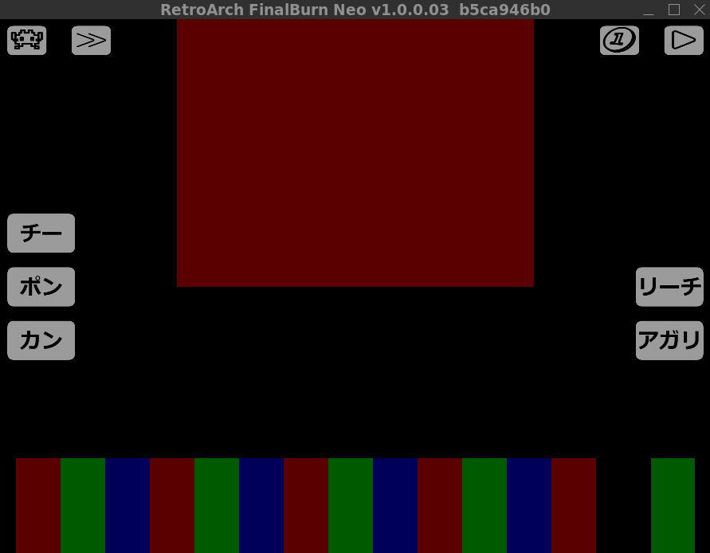

# retroarch_custom_overlays

## 麻雀用オーバーレイ

RetroArchのMAME/FBNeoでスマホなど物理キーボードがない環境で、麻雀ゲームをプレイすることが厳しい。  
そこで、麻雀用のOSDオーバーレイを作成して問題を解決する。  

* 「クイックメニュー > OSDオーバーレイ > オーバーレイの自動スケーリング」を無効にしておかないと、スマホなど広い画面だと牌とボタンがずれる。
* FBNeoでオーバーレイの動作確認をしている際に、操作上の問題でゲームができないケースがでたのでFBNeoを改造（[メモ](#メモ)を参照）している。
* hotgmckなどのマルチスクリーンは考慮していない。Dip Switchesで1画面モード（[メモ](#メモ)を参照）にしてください。

### オーバーレイの種類

|ディレクトリ|説明|
|---|---|
| overlays/mahjong/ | MAME/FBNeoの麻雀用オーバーレイ |
| overlays/mahjong_debug/ | ボタンの位置を確認するためのオーバーレイ |
| overlays/mahjong_arrow_keys/ | チーポンカンリーチを十字ーに割り当てた改造FBNeo用オーバーレイ |

各ディレクトリにはゲームごとにボタンの位置を調整したcfgを含む。  

`mahjong_(ROMファイル名).cfg`

### レイヤー

麻雀用オーバーレイは次の3枚のレイヤーで構成する。

- AからNまでボタンを表示するレイヤー  
牌が表示されない画面でA～Nボタンを押したり、鳴いて牌とボタンがずれたりした時に使用する。
- 牌にボタンを被せたレイヤー  
牌を直接タップして切ったり、Nの位置をタップして牌を引くことができる。
- 何も表示しないレイヤー  
ボタンが重なって情報が読み取りにくい場合などに使用する。

画面の真ん中あたり（画像の広い赤い部分）をタップすると3枚のレイヤーが順繰りに切り替わる。  

#### ボタン

 メニュー切り替え  
 早送りの切り替え  
 コイン投入  
 スタートボタン  

### FBNeoの麻雀ゲーム

FBNeoのDATファイルとソースコードから麻雀ぽいゲームの一覧（クローンは除く）を作成した。  

|ROMファイル名|説明|オーバーレイファイル|
|---|---|---|
| akiss| Mahjong Angel Kiss (ver 1.0)|mahjong_akiss.cfg|
| bnstars1| Vs. Janshi Brandnew Stars|mahjong_bnstars1.cfg|
| cdsteljn| DS Telejan (DECO Cassette) (Japan)|mahjong_cdsteljn.cfg|
| cultures| Jibun wo Migaku Culture School Mahjong Hen|mahjong_cultures.cfg|
| ejanhs| E Jong High School (Japan)|mahjong_ejanhs.cfg|
| hgkairak| Taisen Hot Gimmick Kairakuten (Japan)|mahjong_hotgmck.cfg|
| hotgm4ev| Taisen Hot Gimmick 4 Ever (Japan)|mahjong_hotgmck.cfg|
| hotgmck| Taisen Hot Gimmick (Japan)|mahjong_hotgmck.cfg|
| hotgmck3| Taisen Hot Gimmick 3 Digital Surfing (Japan)|mahjong_hotgmck.cfg|
| hotgmcki| Mahjong Hot Gimmick Integral (Japan)|mahjong_hotgmck.cfg|
| hypreac2| Mahjong Hyper Reaction 2 (Japan)|Joystickモードがあるので不要|
| hypreact| Mahjong Hyper Reaction (Japan)|Joystickモードがあるので不要|
| janjans1| Lovely Pop Mahjong JangJang Shimasho (Japan)|mahjong_janjans1.cfg|
| janjans2| Lovely Pop Mahjong JangJang Shimasho 2 (Japan)|mahjong_janjans2.cfg|
| jongpute| Jongputer|mahjong_jongpute.cfg|
| kirarast| Ryuusei Janshi Kirara Star|mahjong_kirarast.cfg|
| koikois2| Koi Koi Shimasho 2 - Super Real Hanafuda (Japan)|Joystickモードがあるので不要|
| marukin| Super Marukin-Ban (Japan 911128)|mahjong_mgakuen.cfg|
| mgakuen| Mahjong Gakuen|mahjong_mgakuen.cfg|
| mgakuen2| Mahjong Gakuen 2 Gakuen-chou no Fukushuu|mahjong_mgakuen.cfg|
| mirage| Mirage Youjuu Mahjongden (Japan)|mahjong_mirage.cfg|
| mj4simai| Wakakusamonogatari Mahjong Yonshimai (Japan)|mahjong_mj4simai.cfg|
| mjkjidai| Mahjong Kyou Jidai (Japan)|mahjong_mjkjidai.cfg|
| mjnquest| Mahjong Quest (Japan)|mahjong_mjnquest.cfg|
| srmp4| Super Real Mahjong PIV (Japan)|mahjong_srmp4.cfg|
| srmp7| Super Real Mahjong P7 (Japan)|mahjong_srmp7.cfg|
| suchie2| Idol Janshi Suchie-Pai II (ver 1.1)|mahjong_suchie2.cfg|

### MAMEの麻雀ゲーム

MAMEのDATファイルから麻雀ぽいゲームの一覧を作成した。  

- MAME v0.274
- デバイスではない
- 動作する
- クローンではない
- player1のcontrollerがmahjongでボタンが19個以上で30個ではない

|ROMファイル名|説明|オーバーレイファイル|
|---|---|---|
|4psimasy| Mahjong 4P Shimasho (Japan)||
|7jigen| 7jigen no Youseitachi - Mahjong 7 Dimensions (Japan)||
|aimode| Ai-mode - Pet Shiiku (Japan)||
|akamj| Aka Mahjong (Double Bet, ver 1 16)||
|akiss| Mahjong Angel Kiss (ver 1.0)||
|apparel| Apparel Night (Japan 860929)||
|av2mj1bb| AV2Mahjong No.1 Bay Bridge no Seijo (Japan)||
|av2mj2rg| AV2Mahjong No.2 Rouge no Kaori (Japan)||
|avmjts| AV-Mahjong Two Shot (Japan Ver 1.00 1990/05/21)||
|bakatono| Bakatonosama Mahjong Manyuuki (MOM-002 ~ MOH-002)||
|bananadr| Mahjong Banana Dream (Japan 891124)||
|bijokkog| Bijokko Gakuen (Japan 880116)||
|bijokkoy| Bijokko Yume Monogatari (Japan 870925)||
|bikiniko| BiKiNikko - Okinawa de Ippai Shichaimashita (Japan)||
|bishjan| Bishou Jan (Japan, Ver. 203)||
|bnstars1| Vs. Janshi Brandnew Stars||
|cafebrk| Mahjong Cafe Break (Ver. 1.01J)||
|cafedoll| Mahjong Cafe Doll (Japan, Ver. 1.00)||
|cafepara| Mahjong Cafe Paradise (Ver. 1.00)||
|cafetime| Mahjong Cafe Time||
|ccasino| Chinese Casino (Japan)||
|cdsteljn| DS Telejan (DECO Cassette) (Japan)||
|chalgirl| Challenge Girl (Falcon bootleg)||
|chinmoku| Mahjong Chinmoku no Hentai (Japan 900511)||
|chinsan| Ganbare Chinsan Ooshoubu (MC-8123A, 317-5012)||
|citylove| City Love (Japan 860908)||
|cjddz| Chaoji Dou Dizhu (V219CN)||
|cjddzlf| Chaoji Dou Dizhu Liang Fu Pai (V109CN)||
|cjddzp| Chaoji Dou Dizhu Jiaqiang Ban (S300CN)||
|cjtljp| Chaoji Tuolaji Jiaqiang Ban (V206CN)||
|club90s| Mahjong CLUB 90's (set 1) (Japan 900919)||
|cmehyou| Mahjong Circuit no Mehyou (Japan)||
|crystal2| Crystal Gal 2 (Japan 860620)||
|crystalg| Crystal Gal (Japan 860512)||
|crzyddz2| Crazy Dou Di Zhu II||
|csplayh1| Super CD Dai8dan Mahjong Hanafuda Cosplay Tengoku (Japan)||
|csplayh5| Mahjong Hanafuda Cosplay Tengoku 5 (Japan)||
|csplayh6| Mahjong Hanafuda Cosplay Tengoku 6 - Junai-hen (Japan)||
|csplayh7| Cosplay Tengoku 7 - Super Kogal Ranking (Japan)||
|cultname| Seimei-Kantei-Meimei-Ki Cult Name||
|cultures| Jibun wo Migaku Culture School Mahjong Hen||
|daimyojn| Mahjong Daimyojin (Japan, T017-PB-00)||
|daireach| Mahjong Dai-Reach (Japan, TSM012-C01)||
|daireika| Mahjong Daireikai (Japan)||
|daisyari| Daisyarin (Japan)||
|daiyogen| Mahjong Daiyogen (Japan)||
|dakkochn| DakkoChan House (MC-8123B, 317-5014)||
|danchih| Danchi de Hanafuda (J 990607 V1.400)||
|dokyusei| Mahjong Doukyuusei||
|dokyusp| Mahjong Doukyuusei Special||
|dondenmj| Don Den Mahjong (Japan)||
|dragonmj| Dragon Mahjong (Ver 1.20)||
|dtoyoken| Mahjong Dai Touyouken (Japan)||
|dunhuang| Mahjong Dunhuang||
|ejanhs| E Jong High School (Japan)||
|ejsakura| E-Jan Sakurasou (Japan, SYS386F V2.0)||
|emjjoshi| E-Touch Mahjong Series #2: Joshiryou de NE! (Japan)||
|emjscanb| E-Touch Mahjong Series #6: Scandal Blue - Midara na Daishou (Japan)||
|emjtrapz| E-Touch Mahjong Series #7: Trap Zone - Yokubou no Kaisoku Densha (Japan)||
|fengyunh| Fengyun Hui||
|fromanc2| Taisen Idol-Mahjong Final Romance 2 (Japan, newer)||
|fromanc4| Taisen Mahjong Final Romance 4 (Japan)||
|fromance| Idol-Mahjong Final Romance (Japan)||
|fromancr| Taisen Mahjong Final Romance R (Japan)||
|fuudol| Fuudol (Japan)||
|gakusai| Mahjong Gakuensai (Japan, set 1)||
|gakusai2| Mahjong Gakuensai 2 (Japan)||
|gal10ren| Mahjong Gal 10-renpatsu (Japan)||
|galkaika| Mahjong Gal no Kaika (Japan)||
|galkoku| Mahjong Gal no Kokuhaku (Japan)||
|gekisha| Mahjong Gekisha (Japan)||
|goodejan| Good E Jong -Kachinuki Mahjong Syoukin Oh!!- (set 1)||
|hanamomo| Mahjong Hana no Momoko gumi (Japan 881201)||
|hgkairak| Taisen Hot Gimmick Kairakuten (Japan)||
|hipai| Hi Pai Paradise||
|hipai2| Hi Pai Paradise 2||
|hnrose| Hana Night Rose (Japan, TSM008-04)||
|hotgm4ev| Taisen Hot Gimmick 4 Ever (Japan)||
|hotgmck| Taisen Hot Gimmick (Japan)||
|hotgmck3| Taisen Hot Gimmick 3 Digital Surfing (Japan)||
|hotgmcki| Mahjong Hot Gimmick Integral (Japan)||
|hourouki| Mahjong Hourouki Part 1 - Seishun Hen (Japan)||
|housemn2| House Mannequin Roppongi Live hen (Japan 870418)||
|housemnq| House Mannequin (Japan 870217)||
|hypreac2| Mahjong Hyper Reaction 2 (Japan)||
|hypreact| Mahjong Hyper Reaction (Japan)||
|ichiban| Ichi Ban Jyan||
|idhimitu| Idol no Himitsu (Japan 890304)||
|idolmj| Idol-Mahjong Housoukyoku (Japan)||
|iemoto| Iemoto (Japan 871020)||
|imekura| Imekura Mahjong (Japan)||
|ippatsu| Ippatsu Gyakuten (Japan)||
|janbari| Mahjong Janjan Baribari (Japan)||
|jangou| Jangou (Japan)||
|jangtaku| Jang Taku (V 1.3)||
|janjans1| Lovely Pop Mahjong JangJang Shimasho (Japan)||
|janjans2| Lovely Pop Mahjong JangJang Shimasho 2 (Japan)||
|janoh| Jan Oh (set 1)||
|janptr96| Janputer '96 (Japan)||
|janptrsp| Janputer Special (Japan)||
|janputer| New Double Bet Mahjong (bootleg of Royal Mahjong, set 1)||
|janshi| Janshi||
|janshin| Janshin Densetsu - Quest of Jongmaster||
|janshinp| Mahjong Janshin Plus (Japan)||
|jansou| Jansou (set 1)||
|jantotsu| 4nin-uchi Mahjong Jantotsu||
|jantouki| Jong Tou Ki (Japan)||
|janyuki| Jong Yu Ki (Japan)||
|jituroku| Jitsuroku Maru-chi Mahjong (Japan)||
|jngolady| Jangou Lady (Japan)||
|jogakuen| Mahjong Jogakuen (Japan)||
|jongkyo| Jongkyo||
|jongpute| Jongputer||
|jongshin| Jong Shin (Japan)||
|jongtei| Mahjong Jong-Tei (Japan, NM532-01)||
|junai| Junai - Manatsu no First Kiss (Japan)||
|junai2| Junai 2 - White Love Story (Japan)||
|kaguya| Mahjong Kaguyahime (Japan 880521)||
|kaguya2| Mahjong Kaguyahime Sono2 (Japan 890829)||
|kakumei| Mahjong Kakumei (Japan)||
|kakumei2| Mahjong Kakumei 2 - Princess League (Japan)||
|kanatuen| Kanatsuen no Onna (Japan 880905)||
|kirarast| Ryuusei Janshi Kirara Star||
|kisekaem| Kisekae Mahjong||
|kiwame| Pro Mahjong Kiwame||
|kiwames| Pro Mahjong Kiwame S (J 951020 V1.208)||
|koikois2| Koi Koi Shimasho 2 - Super Real Hanafuda (Japan)||
|koinomp| Mahjong Koi no Magic Potion (Japan)||
|konhaji| Konnano Hajimete! (Japan)||
|korinai| Mahjong-zukino Korinai Menmen (Japan 880425)||
|ldmj1mbh| LD Mahjong #1 Marine Blue no Hitomi (Japan)||
|lemnangl| Mahjong Lemon Angel (Japan)||
|lhb| Long Hu Bang (China, V035C)||
|lhb2| Lung Fu Bong II (Hong Kong, V185H)||
|lhdmg| Long Hu Da Manguan (V102C3M)||
|lhdmgp| Long Hu Da Manguan Duizhan Jiaqiang Ban (V400C3M)||
|lhzb| Long Hu Zhengba (China, VS105M, set 1)||
|lhzb2| Long Hu Zhengba 2 (China, set 1)||
|lhzb3| Long Hu Zhengba III (V400CN)||
|lhzb3sjb| Long Hu Zhengba III Shengji Ban (V300C5)||
|lhzb4| Long Hu Zhengba 4 (V104CN)||
|lhzb4dhb| Long Hu Zhengba 4 Dui Hua Ban (V203CN)||
|livegal| Live Gal (Japan 870530)||
|lthyp| Long Teng Hu Yao Duizhan Jiaqiang Ban (S104CN)||
|mac2bios| Multi Amenity Cassette System 2 BIOS||
|macsbios| Multi Amenity Cassette System BIOS||
|mahjngoh| Mahjong Oh (V2.06J 1999/11/23 08:52:22)||
|mahmajn| Tokoro San no MahMahjan (Japan, ROM Based)||
|mahmajn2| Tokoro San no MahMahjan 2 (Japan, ROM Based)||
|majrjhdx| Mahjong Raijinhai DX (Ver. D105)||
|majs101b| Mahjong Studio 101 (Japan)||
|makaijan| Makaijan (Japan)||
|marukin| Super Marukin-Ban (Japan 911128)||
|mayumi| Kiki-Ippatsu Mayumi-chan||
|mcnpshnt| Mahjong Campus Hunting (Japan)||
|mcontest| Miss Mahjong Contest (Japan)||
|menghong| Meng Hong Lou||
|mfunclub| Mahjong Fun Club - Idol Saizensen (Japan)||
|mgakuen| Mahjong Gakuen||
|mgakuen2| Mahjong Gakuen 2 Gakuen-chou no Fukushuu||
|mgcs| Manguan Caishen (China, V103CS)||
|mgcs3| Manguan Caishen 3 (V101CN)||
|mgdh| Manguan Daheng (Taiwan, V125T1)||
|mgmen89| Mahjong G-MEN'89 (Japan 890425)||
|mgzz| Manguan Zhizun (V101CN)||
|mhgaiden| Mahjong Hourouki Gaiden (Japan)||
|mhhonban| Mahjong Housoukyoku Honbanchuu (Japan)||
|minasan| Minasan no Okagesamadesu! Dai Sugoroku Taikai (MOM-001 ~ MOH-001)||
|mirage| Mirage Youjuu Mahjongden (Japan)||
|mj4simai| Wakakusamonogatari Mahjong Yonshimai (Japan)||
|mjangels| Mahjong Angels - Comic Theater Vol.2 (Japan)||
|mjapinky| Almond Pinky (Japan)||
|mjcamera| Mahjong Camera Kozou (Japan 881109, newer hardware)||
|mjchuuka| Maque Zhonghua Ernu (Taiwan)||
|mjclinic| Mahjong Clinic (Japan, set 1)||
|mjclub| Mahjong Club (Japan)||
|mjcomv1| Mahjong Comic Gekijou Vol.1 (Japan)||
|mjdchuka| Maque Da Zhonghua Quan (Taiwan, D111)||
|mjdejavu| Mahjong Shinkirou Deja Vu (Japan)||
|mjderngr| Mahjong Derringer (Japan)||
|mjdialq2| Mahjong Dial Q2 (Japan set 1)||
|mjdiplob| Mahjong Diplomat (Japan)||
|mjegolf| Mahjong Erotica Golf (Japan)||
|mjelctrn| Mahjong Electron Base (parts 2 & 4, Japan)||
|mjflove| Mahjong Fantasic Love (Japan)||
|mjfocus| Mahjong Focus (Japan 890313)||
|mjfriday| Mahjong Friday (Japan)||
|mjgaiden| Mahjong Gaiden (Japan 870803)||
|mjgalpri| Mahjong Gal-pri - World Gal-con Grandprix (Japan)||
|mjgnight| Mahjong Gorgeous Night (Japan, TSM003-01)||
|mjgottsu| Mahjong Gottsu ee-kanji (Japan)||
|mjgottub| Medal Mahjong Gottsu ee-kanji (Japan)||
|mjgtaste| Mahjong G-Taste||
|mjhokite| Mahjong Hourouki Okite (Japan)||
|mjifb| Mahjong If...?||
|mjikaga| Mahjong Ikaga Desu ka (Japan)||
|mjjoship| Mahjong Joshi Pro-wres -Give up 5 byou mae- (Japan)||
|mjkinjas| Mahjong Kinjirareta Asobi (Japan)||
|mjkjidai| Mahjong Kyou Jidai (Japan)||
|mjkoiura| Mahjong Koi Uranai (Japan set 1)||
|mjkojink| Mahjong Kojinkyouju (Private Teacher) (Japan)||
|mjlaman| Mahjong La Man (Japan)||
|mjlstory| Mahjong Jikken Love Story (Japan)||
|mjmaglmp| Mahou no Lamp (v. JAA02)||
|mjmania| Mahjong Mania - Kairakukan e Youkoso (Japan)||
|mjmyorn2| Mahjong The Mysterious Orient Part 2 ~ Exotic Dream ~ (Japan, v1.00)||
|mjmyorntr| Mahjong The Mysterious Orient Returns (Japan, v1.00)||
|mjmyster| Mahjong The Mysterious World (Japan, set 1)||
|mjmyuniv| Mahjong The Mysterious Universe (Japan, D85)||
|mjnanpas| Mahjong Nanpa Story (Japan 890713)||
|mjnatsu| Mahjong Natsu Monogatari (Japan)||
|mjnquest| Mahjong Quest (Japan)||
|mjprivat| Mahjong Private (Japan)||
|mjreach| Mahjong Reach (Ver. 1.00)||
|mjreach1| Mahjong Reach Ippatsu (Japan)||
|mjschuka| Mahjong Super Dai Chuuka Ken (Japan, D115)||
|mjsenka| Mahjong Senka (Japan)||
|mjsenpu| Mahjong Senpu (Japan)||
|mjsikaku| Mahjong Shikaku (Japan 880908)||
|mjsister| Mahjong Sisters (Japan)||
|mjsiyoub| Mahjong Shiyou (Japan)||
|mjtenho| Mahjong Tenho (Japan, P016B-000)||
|mjtensin| Mahjong Tensinhai (Japan)||
|mjuraden| Mahjong Uranai Densetsu (Japan)||
|mjvegasa| Mahjong Vegas (Japan, unprotected)||
|mjyarou| Mahjong Yarou (Japan, set 1)||
|mjyougo| Mahjong-yougo no Kisotairyoku (Japan)||
|mjyuugi| Mahjong Yuugi (Japan set 1)||
|mjzoomin| Mahjong Channel Zoom In (Japan)||
|mkeibaou| Mahjong Keibaou (Japan)||
|mladyhtr| Mahjong The Lady Hunter (Japan 900509)||
|mmahjong| Micom Mahjong||
|mmehyou| Medal Mahjong Circuit no Mehyou (Japan)||
|mogitate| Mahjong Mogitate (Japan)||
|momotaro| Mahjong Momotarou (Japan, T027-RB-01)||
|mrokumei| Mahjong Rokumeikan (Japan)||
|mscoutm| Mahjong Scout Man (Japan)||
|msjiken| Mahjong Satsujin Jiken (Japan 881017)||
|musobana| Musoubana (Japan)||
|mxsqy| Mingxing San Que Yi (China, V201CN)||
|myfairld| Virtual Mahjong 2 - My Fair Lady (J 980608 V1.000)||
|nekkyoku| Rettou Juudan Nekkyoku Janshi - Higashi Nippon Hen (Japan)||
|neruton| Mahjong Neruton Haikujiradan (Japan, Rev. B?)||
|ngalsumr| Night Gal Summer (Japan 850702 NGS 0-01)||
|ngpgal| Nekketsu Grand-Prix Gal (Japan)||
|ngtbunny| Night Bunny (Japan 840601 MRN 2-10)||
|nichidvd| Nichibutsu High Rate DVD BIOS||
|nichisel| DVD Select (Japan)||
|nightgal| Night Gal (Japan 840920 AG 1-00)||
|nightlov| Night Love (Japan 860705)||
|nmsengen| Nekketsu Mahjong Sengen! AFTER 5 (Japan)||
|ntopstar| Mahjong Nerae! Top Star (Japan)||
|nuretemi| Nurete Mitaino... - Net Idol Hen (Japan)||
|ojanko2| Ojanko Yakata 2bankan (Japan)||
|ojankoc| Ojanko Club (Japan, Program Ver. 1.3, set 1)||
|ojankohs| Ojanko High School (Japan)||
|ojankoy| Ojanko Yakata (Japan)||
|ojousan| Ojousan (Japan 871204)||
|orangec| Orange Club - Maruhi Kagai Jugyou (Japan 880213)||
|otatidai| Disco Mahjong Otachidai no Okite (Japan)||
|otonano| Otona no Mahjong (Japan 880628)||
|ougonhai| Mahjong Ougon no Pai (Japan)||
|pachiten| Medal Mahjong Pachi-Slot Tengoku (Japan)||
|pastelg| Pastel Gal (Japan 851224)||
|patimono| Mahjong Pachinko Monogatari (Japan)||
|pokoachu| PokoaPoka Onsen de CHU - Bijin 3 Shimai ni Kiotsukete! (Japan)||
|ponchin| Mahjong Pon Chin Kan (Japan set 1)||
|pongboo2| Pong Boo! 2 (Ver. 1.31)||
|psailor1| Bishoujo Janshi Pretty Sailor 18-kin (Japan)||
|psailor2| Bishoujo Janshi Pretty Sailor 2 (Japan)||
|pstadium| Mahjong Panic Stadium (Japan)||
|qlgs| Que Long Gaoshou (S501CN)||
|qmhayaku| Quiz-Mahjong Hayaku Yatteyo! (Japan)||
|renaiclb| Mahjong Ren-ai Club (Japan)||
|renaimj| Renai Mahjong Idol Gakuen (Japan)||
|rkjanoh2| Royal King Jang Oh 2 (v4.00 1984 Jun 10th)||
|rmhaihai| Real Mahjong Haihai (Japan, newer)||
|rmhaijin| Real Mahjong Haihai Jinji Idou Hen (Japan)||
|rmhaisei| Real Mahjong Haihai Seichouhen (Japan)||
|ron2| Futari Mahjong Ron II||
|ronjans| Ron Jan Super (set 1)||
|royalmj| Royal Mahjong (Japan, v1.13)||
|royalqn| Royal Queen (Japan 841010 RQ 0-07)||
|sailorws| Mahjong Sailor Wars (Japan set 1)||
|sanma| Sanma - San-nin Uchi Mahjong (Japan, version 2.60)||
|scandal| Scandal Mahjong (Japan 890213)||
|sdmg2| Chaoji Da Manguan II (China, V754C, set 1)||
|sdmg2p| Maque Wangchao / Chaoji Da Manguan 2 - Jiaqiang Ban (China, V100C)||
|secolove| Second Love (Japan 861201)||
|seiha| Seiha (Japan 870725)||
|seljan| Sel-Jan (Japan)||
|seljan2| Return Of Sel Jan II (Japan, NM557)||
|sengokmj| Sengoku Mahjong (Japan)||
|sengomjk| Sengoku Mahjong Kurenai Otome-tai (Japan)||
|sexygal| Sexy Gal (Japan 850501 SXG 1-00)||
|sgaltrop| Sexy Gal Tropical (Japan 850805 SXG T-02)||
|shabdama| LD Mahjong #4 Shabon-Dama (Japan)||
|shangril| Dengen Tenshi Taisen Janshi Shangri-la||
|sjryuko| Sukeban Jansi Ryuko (set 2, System 16B, FD1089B 317-5021)||
|srmp1| Super Real Mahjong Part 1 (Japan)||
|srmp2| Super Real Mahjong Part 2 (Japan)||
|srmp3| Super Real Mahjong Part 3 (Japan)||
|srmp4| Super Real Mahjong PIV (Japan)||
|srmp5| Super Real Mahjong P5||
|srmp6| Super Real Mahjong P6 (Japan)||
|srmp7| Super Real Mahjong P7 (Japan)||
|srmvs| Super Real Mahjong VS (Rev A)||
|sryudens| Mahjong Seiryu Densetsu (Japan, NM502)||
|suchie2| Idol Janshi Suchie-Pai II (ver 1.1)||
|suchie3| Idol Janshi Suchie-Pai 3 (Japan)||
|suchiesp| Idol Janshi Suchie-Pai Special (Japan)||
|suzume| Watashiha Suzumechan (Japan)||
|swinggal| Swing Gal (Japan 871221)||
|taiwanmb| Taiwan Mahjong (Japan 881208)||
|tarzanc| Tarzan Chuang Tian Guan (China, V109C, set 1)||
|telmahjn| Telephone Mahjong (Japan 890111)||
|tenkai| Mahjong Tenkaigen (Japan)||
|themj| The Mah-jong (Japan, set 1)||
|thenanpa| The Nanpa (Japan)||
|tmmjprd| Tokimeki Mahjong Paradise - Dear My Love||
|tokyogal| Tokyo Gal Zukan (Japan)||
|tonpuu| Ton Puu Mahjong Version 2.0 RX (Japan)||
|tontonb| Tonton (Japan)||
|torarech| Torarechattano - AV Kantoku Hen (Japan)||
|totmejan| Tottemo E Jong||
|touryuu| Touryuumon (V1.1)?||
|treamary| Treasure Mary||
|triplew1| Mahjong Triple Wars (Japan)||
|triplew2| Mahjong Triple Wars 2 (Japan)||
|tsuwaku| Tsuugakuro no Yuuwaku (Japan)||
|uchuuai| Mahjong Uchuu yori Ai wo komete (Japan)||
|ultramhm| Ultra Maru-hi Mahjong (Japan)||
|urashima| Otogizoushi Urashima Mahjong (Japan)||
|usagi| Usagi (V2.02J 2001/10/02 12:41:19)||
|usagiym| Usagi - Yamashiro Mahjong Hen (Japan) (GDL-0022)||
|vanilla| Mahjong Vanilla Syndrome (Japan)||
|vitaminc| Mahjong Vitamin C (Japan)||
|vmahjong| Virtual Mahjong (J 961214 V1.000)||
|vsmjtria| VS Mahjong Triangle||
|warahana| Warai no Hana Tenshi (Japan)||
|wcatcher| Mahjong Wakuwaku Catcher (Japan)||
|xymg| Xingyun Man Guan (China, V651C)||
|yarunara| Mahjong Yarunara (Japan)||
|yosimoto| Mahjong Yoshimoto Gekijou (Japan)||
|yujan| Yu-Jan||
|zhongguo| Zhongguo Chu Da D (V102C)||

## メモ

- FBNeoでbnstars1は動かないがクローンのbnstarsは動く
- FBNeoでjongputeは動かないがクローンのttmahjngは動く
- FBNeoはオーバーレイのキーボード入力が期待通りに動かないのでコアを改造する必要あるかもしれません。 
- [改造FBNeo](https://github.com/osobaudonmen/FBNeo)
  - [チーポンカンリーチを十字キーに割り当てる](https://github.com/libretro/FBNeo/commit/5aa25b959dd24b6599b8a41f3b38fa6136f7dac0)
  - [オーバーレイのキーボード入力対応](https://github.com/libretro/FBNeo/commit/cd59d8c56b3434bba46c51b84f01bc7e9579145a)
  - [mgakuenでコインが入らない問題対応](https://github.com/libretro/FBNeo/commit/2f02c62a0e4aaea30c8946ffdf2fb0f4d4ac99a6)
  - [mgakuen2のオーバーレイでNが効かない問題対応](https://github.com/libretro/FBNeo/commit/92ab04c7a619f16ebe329c03bc3627818663497e)
- 牌を選択しても反応しないと思ったらmahjong_debugを使って牌とボタンの位置が一致しているか確認するとよい。だいたい「オーバーレイの自動スケーリング」でずれている。
- MAMEのhotgmckの初期表示が2画面表示になっているのを、スマホでも（物理キーボードがなくても）次の手順で1画面表示にできる。
  1. OSDオーバーレイでキーボード（標準のoverlays/keyboards/US-101とか）を選ぶ。
  2. Tabを押すとMAMEのオプションメニューがでる。今後の処理は十字キーとエンターで操作する。
  3. Video Optionsを選択する
  4. Screen #0を選ぶ
  5. Screen 0 Standard (4:3) とか Screen 0 Pixel Aspect (10:7) を選ぶ
  6. MAMEのオプションメニューが閉じるまでEscキーを押す
- とりあえず牌とボタンの調整だけをしたが、ポンとかのボタンをゲームごとに邪魔にならない位置に避けたい
